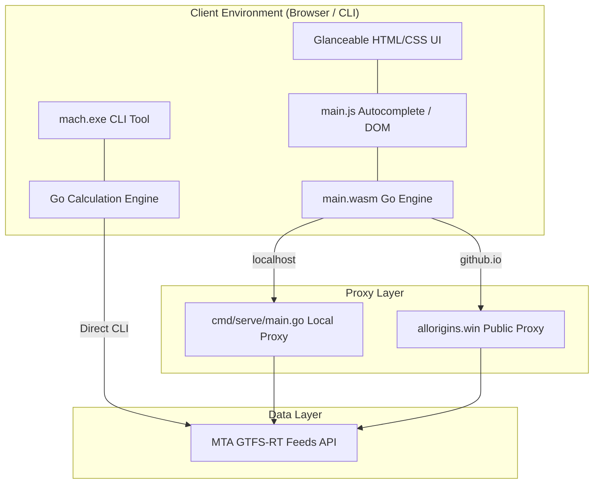

# Product Requirement Document (PRD) - WaitWatchers

## 1. Executive Summary

### 1.1 Project Overview
WaitWatchers is a high-performance, utility-focused transit decision engine designed for New York City subway riders. By utilizing official, real-time Metropolitan Transportation Authority (MTA) GTFS-RT data feeds, the system calculates the "Wait Delta"—the precise difference in arrival times at a destination between boarding the next immediately arriving train or waiting for a faster express train. The product is delivered via a lightweight command-line interface (CLI) and a visually optimized, client-side WebAssembly (WASM) web application.

### 1.2 Problem Statement
NYC subway riders standing at major transit complexes face a daily "fog of war" decision: *Should I take this local train immediately, or should I wait on the platform for the next express train?* 
This choice paralysis is exacerbated during:
- **Late-night or off-peak hours** when headways (train intervals) span 15 to 25 minutes, making a wrong decision highly punishing.
- **Cross-line connections** at major transit hubs where multiple independent lines (such as the A/C/E and the 1/2/3 at the 42 St-Times Sq/Port Authority complex) run toward the same northern or southern destinations.

Standard navigation tools (e.g., Google Maps, Apple Maps) focus on routing from point A to B but fail to provide instant, comparative, platform-level dashboards to resolve choice paralysis in under 2 seconds.

### 1.3 Target Audience
- **Daily NYC Commuters**: Time-sensitive riders looking to optimize their daily commutes down to the minute.
- **Off-Peak & Late-Night Travelers**: Commuters navigating transit during periods of reduced headways who cannot afford to miss a connection.
- **Power Transit Users**: Riders who understand the layout of station complexes and want a tool that matches their platform-swapping behavior.

---

## 2. Product Strategy & Core Value Propositions

- **Glanceability (2-Second Decision Loop)**: The user interface is designed so that a commuter running down station stairs can open the app, view the recommended train and time-savings, and make a decision instantly.
- **Cross-Line Connectivity (Transit Hubs)**: Unlike single-platform apps, WaitWatchers treats physically connected stations as a unified complex (e.g., merging Times Square and Port Authority). It compares schedules across completely different lines (e.g., comparing the A train against the 1 train).
- **High-Fidelity Reliability**: Engineered to resolve real-world edge cases—such as terminal station start times (where arrival predictions do not exist) and CORS restrictions in browser sandboxes—without sacrificing data freshness.

---

## 3. User Personas & Use Cases

### 3.1 User Personas
- **"Express Elena" (The Daily Commuter)**: Elena commutes from Washington Heights to Chelsea. She uses WaitWatchers on the platform at 168th Street to decide whether to board the arriving C local or wait 4 minutes for the A express. Saving 5 minutes per day is critical to her schedule.
- **"Late-Night Leo" (The Night Shift Worker)**: Leo finishes work at 2:00 AM near Times Square and travels uptown. With trains running 20 minutes apart, he uses the app to check whether he should run to the A platform or walk to the 1 platform. A wrong choice means standing on a cold platform for 20 minutes.

### 3.2 Key Use Cases
- **Platform Choice Paralysis**: Commuter is on the platform; local train is arriving. The engine calculates the delta to destination: *Board local now or wait for the express?*
- **Cross-Platform Transfer Hub Decision**: Commuter is entering a massive transit hub (e.g., 14 St-Union Sq). The engine compares lines (e.g., 4/5/6 vs. N/Q/R/W) to advise which platform to walk to.
- **Terminal Origin Departures**: Commuter starts a trip at a terminal (e.g., Flushing-Main St). The system checks departure predictions to ensure calculations work at the beginning of train runs.

---

## 4. Functional Specifications & Feature Requirements

### 4.1 Grouped Autocomplete Search & Line Badges
* **Description**: Users must find their origin and destination stations easily out of 200+ stops.
* **Requirements**:
  - Filter stations by substring matching (case-insensitive).
  - Group physically connected stations (fare-control connected platforms) into a single "Transit Hub".
  - Append styled subway line badges in the autocomplete dropdown menu next to each station name to make transit options instantly clear.
  - Implement full keyboard navigation (Arrow keys, Enter, Escape) and clear-button controls.

### 4.2 Wait Delta Calculation Engine
* **Description**: Core algorithmic engine that ingests predictions and outputs travel recommendations.
* **Requirements**:
  - Filter raw GTFS-RT feed predictions to isolate trains passing through the specified origin.
  - Track matched trains to their predicted arrival time at the specified destination.
  - Calculate the arrival time difference between the fastest and second-fastest line options.
  - Output clear recommendations: `TAKE THE [LINE] TRAIN` (if delta is non-zero) or `TAKE EITHER TRAIN` (if delta is zero).
  - Implement fallback handling for terminal stations by checking `DepartureTime` if `ArrivalTime` is zero or unavailable.

### 4.3 Interactive Station Swapping
* **Description**: Single-action switch to swap origin and destination.
* **Requirements**:
  - One-click swap button situated between origin and destination inputs.
  - Trigger a visual rotation animation on click.
  - Instantly swap the field values, re-validate inputs, and trigger a recalculation automatically if results are currently active.

### 4.4 Dynamic Network Proxy Selector
* **Description**: Bypasses browser CORS restrictions while maintaining CLI utility independence.
* **Requirements**:
  - Detect host environment at runtime.
  - If running in a browser on a custom domain/GitHub Pages (`*.github.io`), route calls through a public CORS-proxy (`https://api.allorigins.win/raw?url=...`).
  - If running on localhost, route requests through the local Go backend proxy (`/api/mta?url=...`).
  - If running in a CLI environment, bypass proxies and fetch directly from the MTA.

---

## 5. Technical & Interface Architecture

### 5.1 Technology Stack
- **Backend / CLI Core**: Go (Golang) for high-speed protocol buffer parsing and calculation logic.
- **Frontend Core**: WebAssembly (Go WASM) compilation to run the calculation engine natively inside the browser.
- **UI Styling**: Vanilla CSS using custom HSL colors, responsive grid layouts, and glassmorphic reflections.
- **Deployment**: Static web hosting via GitHub Pages with automated CI/CD builds powered by GitHub Actions.

---

## 6. Product Success Metrics & KPIs

To measure the product's effectiveness, the following key performance indicators (KPIs) are tracked:

| Metric | Target | Description |
| :--- | :--- | :--- |
| **WASM Initialization Time** | < 500ms | Latency for the WebAssembly module to load and declare the engine active. |
| **Fetch & Calculation Latency** | < 1.5s | Round-trip duration from clicking "Calculate" to rendering the recommendation. |
| **Recommendation Accuracy** | &plusmn; 2 min | Deviation of predicted wait deltas from real-world train arrivals. |
| **Search Conversion Rate** | > 95% | Percentage of user inputs that successfully resolve to a station via autocomplete. |
| **Offline Reliability** | 99.9% uptime | Availability of the CORS-proxy bridge to access live MTA data. |

---

## 7. Product Roadmap & Future Refinements

### Phase 1: Core Engine & Rebuild (Completed)
- Resolve duplicate main compilation errors and isolate CLI and web entrypoints.
- Create a CORS proxy server handler to bypass browser restrictions.
- Fix terminal station prediction issues.
- Design the premium glassmorphic user interface.

### Phase 2: Transit Hubs & Autocomplete Badges (Completed)
- Group connection complexes in the station database.
- Append served lines in autocomplete list suggestions.
- Render color-coded subway line badges inside suggestions.
- Implement suffix-stripping resolution logic.

### Phase 3: Commuter Enhancements (Planned)
- **Geolocation Integration**: Auto-detect the user's GPS coordinates and pre-populate the Origin field with the closest Transit Hub.
- **Multi-Leg Transfers**: Enhance the engine to calculate transfer options (e.g., taking the 2 train to 96th St and transferring to the 1 train) for journeys where no direct lines connect the origin and destination.
- **Service Alert Overlays**: Ingest MTA service alerts to warn users of active delays, route changes, or suspensions on recommended lines.
